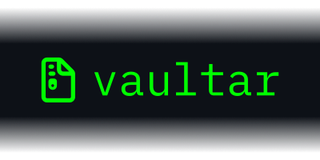

# Vaultar - Backup Seguro e Eficiente

<p align="center">
  
</p>

Vaultar e uma ferramenta de linha de comando (CLI) poderosa e intuitiva para realizacao de backups seguros. Desenvolvido em Python, ele foca em simplicidade, seguranca e performance, permitindo que voce proteja seus dados com compressao moderna e criptografia robusta.

O projeto oficial reside em: https://github.com/marcelositr/vaultar

## Funcionalidades Principais

- **Compressao Flexivel**: Suporte para `tar`, `tar.gz`, `tar.zst` e `zip`.
- **Criptografia GPG**: Protecao de arquivos usando senhas (simetrica) ou chaves GPG (assimetrica).
- **Interface Interativa**: Guia o usuario passo a passo caso nenhum parametro seja fornecido.
- **Feedback Visual**: Barra de progresso com animacao Braille para acompanhamento em tempo real.
- **Restore Inteligente**: Recuperacao de arquivos preservando caminhos absolutos e nomes originais.
- **Logs Completos**: Registro de todas as operacoes em formato texto e JSON para auditoria.

## Instalacao Rapida

Para instalar o Vaultar diretamente do repositorio:

```bash
git clone https://github.com/marcelositr/vaultar.git
cd vaultar
pip install -e .
```

*Certifique-se de ter o `gnupg` instalado em seu sistema operacional.*

## Uso Basico

Basta executar o comando `vaultar` para iniciar o modo interativo:

```bash
vaultar
```

Ou utilize a linha de comando para execucoes rapidas:

```bash
vaultar ~/Documentos -d /mnt/backup -c tar.gz -e senha
```

## Documentacao Completa (Wiki)

Para informacoes detalhadas sobre configuracao, comandos avancados e perguntas frequentes, visite nossa Wiki:

- [Home](wiki/Home.md)
- [Instalacao e Configuracao](wiki/Instalacao-e-Configuracao.md)
- [Guia de Uso](wiki/Guia-de-Uso.md)
- [Perguntas Frequentes (FAQ)](wiki/FAQ.md)

## Licenca

Este projeto esta sob a licenca MIT. Consulte o arquivo [LICENSE](LICENSE) para mais detalhes.
